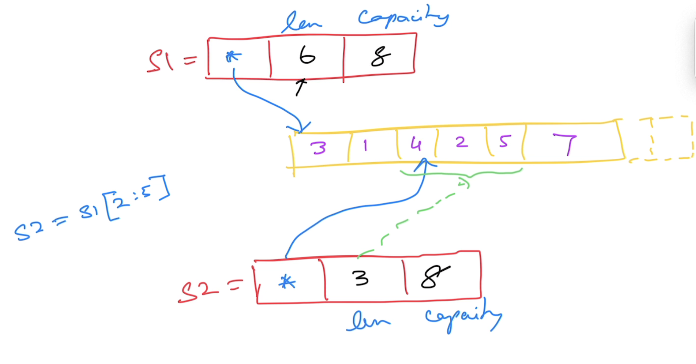

# Go Foundation

## Magesh Kuppan
- tkmagesh77@gmail.com

## Schedule
| What | When |
|-----|----|
| Commence | 9:00 AM |
| Tea Break | 10:30 AM (20 mins) |
| Lunch Break | 12:30 PM (1 hour) |
| Tea Break | 3:00 PM (20 mins) |
| Wind up | 4:30 PM |

## Software Prerequisites
- Go Tools (https://go.dev/dl)
- Visual Studio Code (http://code.visualstudio.com)
    - Go Extension (https://marketplace.visualstudio.com/items?itemName=golang.Go)

## Repository
- https://github.com/tkmagesh/cisco-gofoundation-dec-2025

## Methodology
- No powerpoint
- Code & Discussion

## Why Go?
- Simplicity
    - ONLY 25 keywords
    - No access modifiers (public, private, protected)
    - No reference types (everything is a value)
    - No class (only structs)
    - No inheritance (only composition)
    - No pointer arithmatic
    - No exceptions (only errors)
    - No try..catch..finally construct
    - No implicit type conversion
- Performance
    - Equivalent to C++
    - Close to hardware
        - Compile to machine code
        - Tooling support for cross-compilation
- Support for Concurrency
    - Concurrency problems are typically solved using OS Threads
        - OS Threads are costly (~2MB of memory)
    - Go offers a cheaper & efficient alternatives called "Goroutines"
        - Goroutines (2KB of memory)
        - Built in scheduler
    - Language support for concurrency
        - "go" `keyword`
        - "chan" `data type`
        - "<-" `operator`
        - "range" `construct`
        - "select-case" `construct`
    - Standard Library support
        - `sync` package
        - `sync/atomic` package

## Compilation
```shell
go build <filename.go>
# ex : go build 01-hello-world.go

go build -o <binary_name> <filename.go>
# ex : go build -o hw 01-hello-world.go
```

### Compilation & Execution
```shell
go run <filename.go>
# ex : go run 01-hello-world.go
```

### Cross Compilation

#### Environment variables for cross compilatio
- GOOS
- GOARCH

#### To get the list of support platforms
```shell
go tool dist list
```

#### To get the environment variables used by the go tool
```shell
# list all 
go env

# get specific
go env <var_1> <var_2> ...
```

#### To change the environment variable values
```shell
go env -w <var_1>=<new_value_1> <var_2>=<new_value_2> ...
```

#### To cross compile (in mac & linux)
```shell
GOOS=windows GOARCH=amd64 go build 01-hello-world.go
```

#### In windows (powershell)
```powershell
$env:GOOS="windows"; $env:GOARCH="amd64"; go build <filename.go>
```

## Standard Library documentation
- https://pkg.go.dev/std

## Data Types
- string
- bool
- integers family
    - int8
    - int16
    - int32
    - int64
    - int
- unsigned integers family
    - uint8
    - uint16
    - uint32
    - uint64
    - uint
- floating points family
    - float32
    - float64
- complex family
    - complex64 ( real[float32] + imaginary[float32] )
    - complex128 ( real[float64] + imaginary[float64] )
- aliases
    - byte (alias for unsigned int)
    - rune (alias for unicode code point)

### Zero values
| Data Type | Zero value |
------------ | ------------- |
|int family     | 0 |
|uint family    | 0 |
|complex family | (0+0i) |
|string         | "" (empty string) |
|bool           | false |
|byte           | 0 |
|interface      | nil |
|pointer        | nil |
|function       | nil |
|struct         | struct instance |

## Scope
### Block Scope
### Function Scope
- CAN use ":="
- CANNOT have unused variables

### Package Scope
- CANNOT use ":="
- CAN have unused variables

## iota
Auto generated values for a `group` of constants

## constructs
- if else
- for
- switch case
- function

## Functions
- Functions can return more than one result
    - Named results
- Variadic functions
- Anonymous functions
    - function defined in another function
    - Cannot have a name
    - Has to be immediately invoked (if not assigned to a variable)
- Higher Order Functions (functions can be treated like data)
    - Functions can be assigned as values to variables
    - Functions can be passed as arguments to other functions
    - Functions can be returned as return values from other functions

## Collections
### Arrays
- **Fixed** sized typed collection

### Slices
- **Varying** sized typed collection
- Maintains a pointer to an underlying array


### Maps
- Typed collection of key/value pairs

## Error Handling
- Errors are values returned from a function
- By convention, errors should implement the "error" interface
- Creating an error
    - errors.New()
    - fmt.Errorf()
    - Custom type implementing the 'error' interface
    
## Panic & Recovery
### Panic
- **panic** represents the state of the application where the application execution is unable to proceed further
- Use `panic()` to programmatically create and raise a panic

### Recovery
- Use `recover()` to get the error that resulted in the panic
- Best used in deferred functions


## Modules & Packages
### Module
- Any code need to be versioned and deployed together
- Typicall a folder with a `go.mod` file

#### go.mod file
- mainfest file for the module
- contains
    - name of the module
        (advisable to include the repo path in the name of the module)
    - go version targetted
    - references to 3rd party modules used 
- create
```shell
go mod init <module_name>
```

##### To execute a module
```shell
go run .
```

##### To build a module
```shell
go build .
# OR
go build -o <binary_name> .
```


### Package
- internal organization of code in a module
- typically folders

### Using 3rd party modules
#### To add a 3rd party module
```shell
go get <module_name>
```
The module code is downloaded into the `GOPATH\pkg\mod` folder

#### To updated the references
```shell
go mod tidy
```

#### To download the dependencies documented in the go.mod file
```shell
go mod download
```

#### To localize the dependency code in the application folder
```shell
go mod vendor
```

#### To get the dependency graph of a package
```shell
go mod why <module_name>
```

#### To get the dependency graph of all the all the dependencies
```shell
go mod graph
```

#### `go mod` command reference
- https://go.dev/ref/mod 


## OOP
### Structs
### Struct Composition
### Methods
- functions with receivers
### Type Assertion
### Interfaces

## Concurrency
### Concurrent Design
- The application is designed in such a way that it has more than one execution path
- Concurrent execution of independent execution paths were typically achieved with the help of OS Threads

- OS Threads are very costly (~2MB)

### sync.WaitGroup
- Semaphore based counter
- Has the ability to block the execution of a function until the counter becomes 0